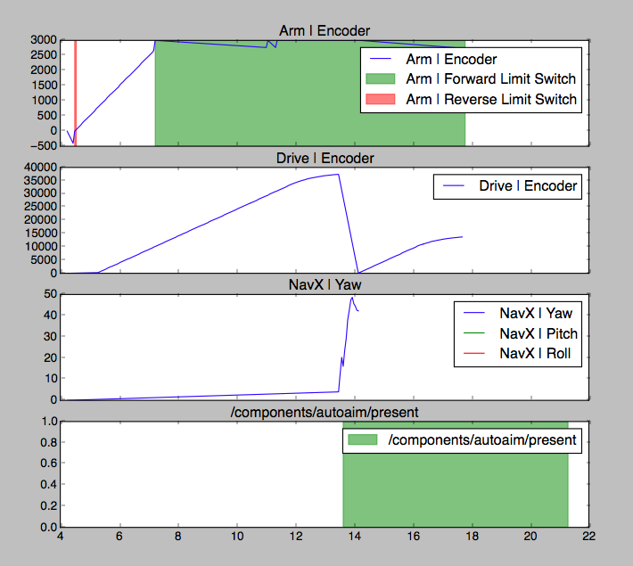

#RobotRecorder

####Records NetworkTable values from robot and displays them on graphs for debugging purposes

##Recorder

~~~bash
./recorder.py
~~~

####Info

- Grabs all NetworkTable values on the IP given. These values will be stored on disconnect from server to be accessed later by the reader in `saves/`
- Shows live data from NetworkTables when connected to a server.
- **WARNING:** Do not exit the recorder until disconnected from the server. Data **WILL NOT** be stored.

####Options

- Verbose: `-v` or `verbose`
- IP: `-ip 127.0.0.1`
	- localhost is defualt
- Config: `-c config.json` or `--config config.json`
	- Config file for live graphing of data

##Reader

~~~bash
./reader.py
~~~

####Options

- Files: `-f savefile.ntstore` or `--file savefile.ntstore`
	- Defualts to example ntstore from 1418's match 55 in finals
- Config: `-c config.json` or `--config config.json`
	- Defualts to `ExampleConfig.json` configured for 1418's 2016 robot
- List: `-l` lists the keys in a ntstore file

###Configuration file

See `EaxampleConfig.json`
